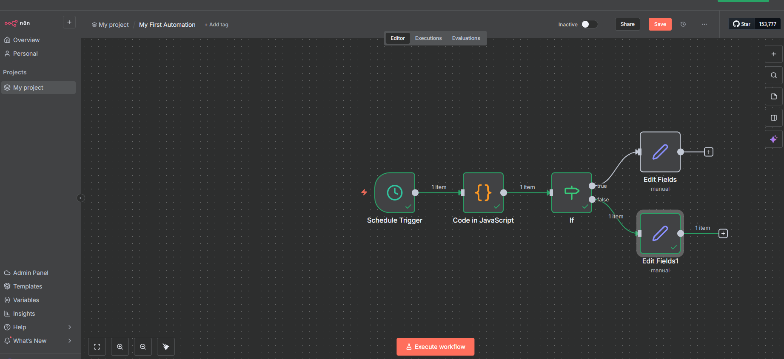
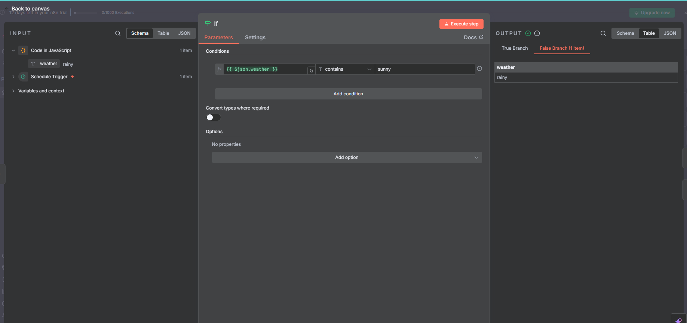
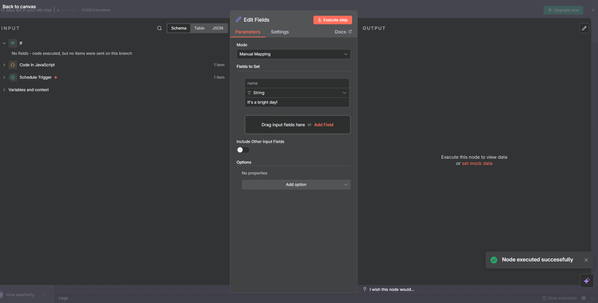

My-First-Automation-Wayfair-Externship-
Built an automated workflow using n8n that runs on a scheduled trigger, executes custom logic via JavaScript, and routes data through conditional paths using an If node. This workflow demonstrates event-based automation, dynamic decision-making, and branching logic — foundational skills for AI agent and cloud automation design.

🤖 My First Automation Workflow
Platform: n8n
Tech Stack: JavaScript • Conditional Logic • Workflow Automation
Status: Completed (Wayfair Externship – Module 1)

🧭 Overview
This project demonstrates a foundational automation workflow built in n8n, featuring scheduled triggers, inline JavaScript processing, and conditional branching with dynamic data output.
It serves as the base framework for future AI-powered and multi-cloud automation projects.

⚙️ Workflow Components
🕒 1. Schedule Trigger
Initiates the workflow automatically at defined intervals — simulating real-world, event-driven automations such as:

Daily health checks
Data refresh routines
Alert system triggers

🧩 2. Code in JavaScript
Executes a custom script to define and manipulate data before evaluation.
This introduces programmable control inside a visual workflow environment.

🔀 3. If Node
Applies conditional logic to determine which execution path to follow:

If condition == true → perform Action A  
Else → perform Action B

### 🧠 4. Edit Fields (True/False Branches)

---

---

---

## 📜 Relevant Certifications

| Certification | Credential Link | Alignment with Project |
|----------------|-----------------|------------------------|
| **CompTIA Cloud+ (CV0-004)** |  | Demonstrated cloud automation, orchestration, and workflow design using n8n. |
| **CompTIA Security+ (SY0-701)** |  | Applied secure design practices to manage credentials, API connections, and data integrity. |
| **AWS Certified Cloud Practitioner** |  | Leveraged AWS event-driven design and automation principles. |
| **Microsoft Certified: Azure Fundamentals (AZ-900)** |  | Demonstrated knowledge of cloud workflow automation and infrastructure logic. |
| **Linux Essentials (LPI)** |  | Showcased automation and scripting concepts aligned with Linux process management. |
| **ITIL 4 Foundations** |  | Supported structured workflow management and continuous improvement processes. |

---

